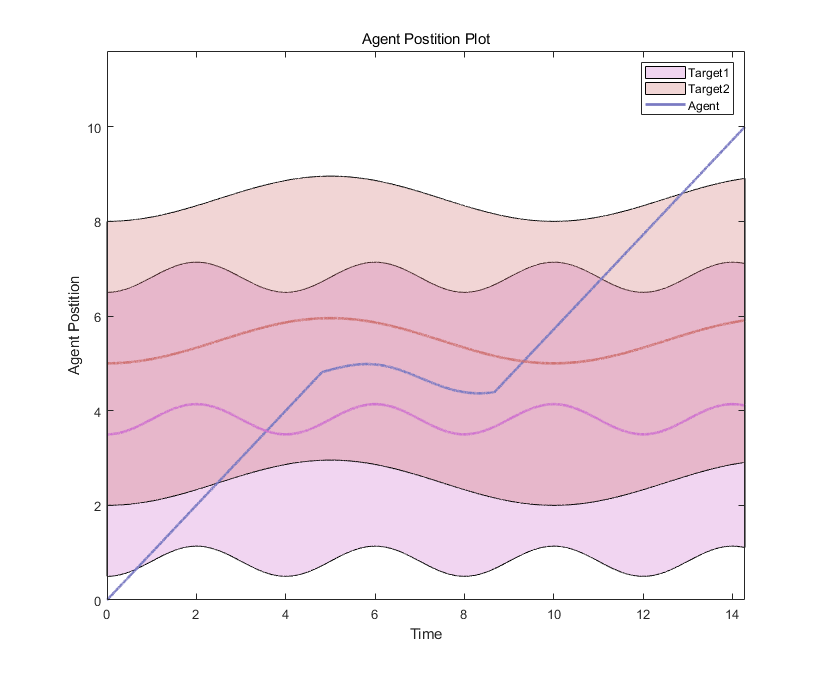
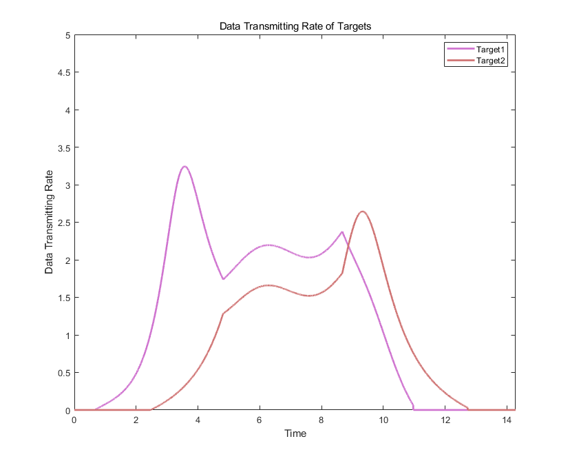
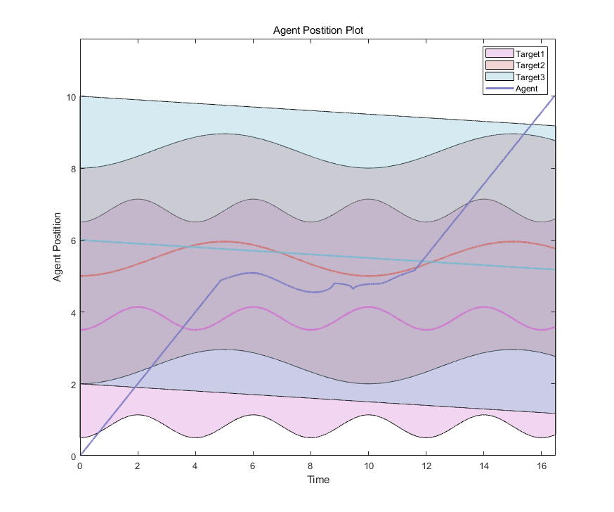

# OptimalControlMobileWSNs
Time Optimal Control for Data Harvesting in Mobile Wireless Sensor Networks (2024)

Notations:

1.MatLab Code of Particle Swarm Optimization for Data Harvesting Problem with Mobile Sensors.

2.Before running the code, there are two toolboxes needed. Please follow the instruction on command window to install them.

3.To run the code, choose the scenario you like and then open the corresponding "Main project..." file on MatLab.

4.Example of simulation figures:

(1)Trajectory of optimal solution for 2 sensor nodes

(2)Data Rate of optimal solution for 2 sensor nodes

(3)Trajectory of optimal solution for 3 sensor nodes

(4)Data Rate of optimal solution for 3 sensor nodes

