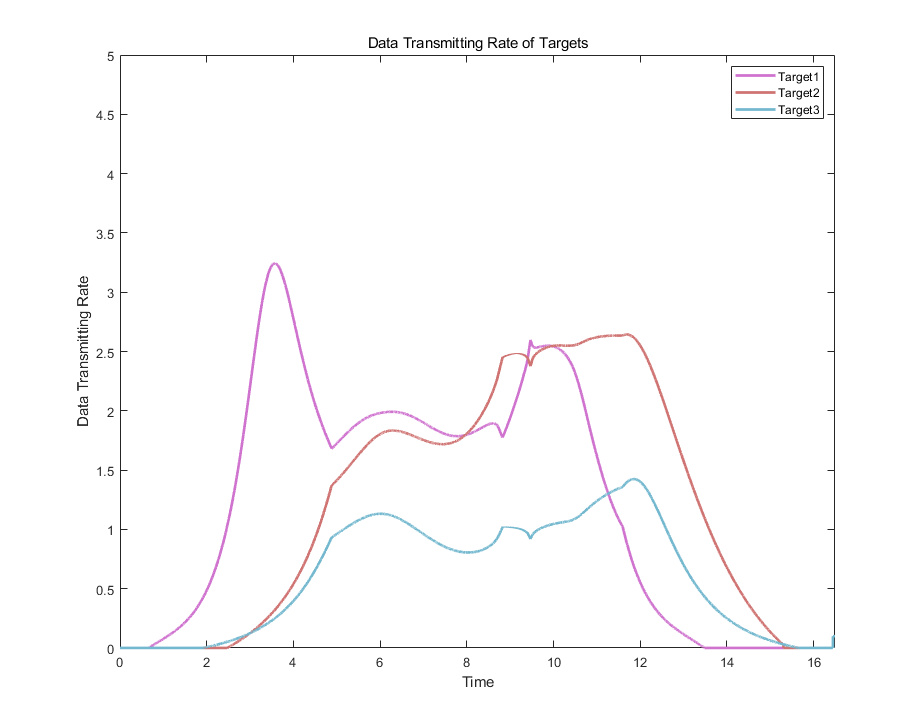

# OptimalControlMobileWSNs
Time Optimal Control for Data Harvesting in Mobile Wireless Sensor Networks (2024)

Paper Abstract - 
We consider the problem of finding an optimal
trajectory of a single agent tasked with harvesting data
from multiple mobile sensor nodes in a wireless sensor
network. We describe the data transmission model using
a free-space broadcast communication scheme and formulate
an optimal control problem to extract the data from all
the nodes in minimal time. In a one-dimensional mission
space, we demonstrate that the optimal motion strategy can
be expressed in parametric form. Within this strategy, the
agent’s motion is determined by a sequence of two modes,
alternating between full-speed travel and a motion derived
from a parametric convex combination function of sensor
velocities. We present two approaches for solving the parametric
optimal control problem, a gradient-descent-based
scheme and a heuristic search method. The effectiveness
of these methods is validated through simulations.

Notations:

1.MatLab Code of Particle Swarm Optimization for Data Harvesting Problem with Mobile Sensors.

2.Before running the code, there are two toolboxes needed. Please follow the instruction on command window to install them.

3.To run the code, choose the scenario you like and then open the corresponding "Main project..." file on MatLab.

4.Example of simulation figures:

(1)Trajectory and data Rate of optimal solution for 2 sensor nodes

     

          
          
     

(2)Trajectory and data rate of optimal solution for 3 sensor nodes

     

          
          
     

